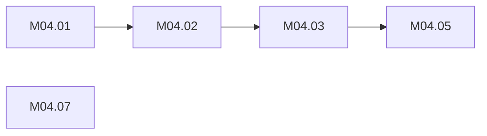

# /mae-plan — Plan & Roadmap

Own the roadmap lifecycle. Create milestones, enrich them with execution details, generate task files.

$ARGUMENTS — optional: milestone number, "roadmap", or specific items

## Usage

```
/mae-plan                    → smart default: create roadmap or enrich next milestone
/mae-plan roadmap            → create or update the full roadmap
/mae-plan {milestone}        → enrich a specific milestone with execution notes + tasks
/mae-plan {item numbers}     → generate task files for specific roadmap items
```

## Prerequisites
- `docs/02-specs/ARCHITECTURE.md` must exist (architecture informs the plan)
- `docs/02-specs/REQUIREMENTS.md` should exist (requirements inform priorities)
- If neither exists: warn and suggest running `/mae-architecture` first

## Behavior

### Create Roadmap (no roadmap exists)

1. **Read inputs:**
   - `docs/02-specs/ARCHITECTURE.md` (components, tech stack, architecture)
   - `docs/02-specs/REQUIREMENTS.md` (requirements, epics, priorities)
   - `DECISIONS.md` (confirmed decisions)
   - `.maestro/templates/roadmap.md` (output structure)

2. **Generate `docs/03-plan/ROADMAP.md`:**
   - Group work into milestones by theme (foundation, features, polish, etc.)
   - Each milestone gets a version target, description, and item table
   - Items include: priority, effort estimate, dependencies, status (☐ todo)
   - Include "Done when" definition for each milestone
   - Emit the `## Milestone Map` block near the top of the file (see § Dependency Graphs)

3. **Save report** to session folder

### Enrich Milestone (roadmap exists)

1. **Read inputs:**
   - `docs/03-plan/ROADMAP.md` (the milestone to enrich)
   - `docs/02-specs/ARCHITECTURE.md` (architecture details)
   - Existing tasks in `docs/03-plan/tasks/` (avoid duplicates)

2. **Add execution notes** to the milestone section in ROADMAP.md:
   ```markdown
   ### Execution Notes
   **Dependency graph:**
     1.1 → 1.3 → 1.5
     1.2, 1.4 can run in parallel

   **Critical path:** 1.1 → 1.7
   **Parallelizable:** 1.2, 1.4, 1.6
   ```

3. **Generate task files** directly in `docs/03-plan/tasks/`:
   - One file per task: `M{MM}.{NN}-{slug}.md` (e.g., `M03.01-skill-spike.md`) — the ID matches the ROADMAP `#` column exactly; sub-tasks append a letter (`M03.01a-…`)
   - Using `.maestro/templates/task.md` format (ID + Milestone fields filled)
   - Add a link to the new task file in the ROADMAP item's Task column

4. **Emit the dependency graph** (see § Dependency Graphs) — the `### Dependencies` block for this milestone, replacing any existing one

5. **Save report** to session folder

### Update Roadmap

When invoked with `roadmap` argument on an existing roadmap:
- Re-read requirements and design for changes
- Suggest additions, removals, or reprioritizations
- Show proposed changes for review before applying
- Re-emit the `## Milestone Map` and any `### Dependencies` block whose milestone changed

## Dependency Graphs

`/mae-plan` already orders tasks by the `Depends` column to sequence them. Emit the graph it built, as Mermaid, so the plan renders on GitHub and in `/status --graph`. Nothing else derives dependency order; this is the single rendering.

**Per milestone** — a `### Dependencies` block at the end of the milestone section, wrapped in HTML-comment markers so a re-run replaces it instead of appending a second one:

````markdown
### Dependencies
<!-- deps:M04 -->

<!-- /deps:M04 -->
````

Rules: node id = task ID with `.` replaced by `_`; label = the task ID (Mermaid does not accept dots in ids); one edge per `Depends` entry, from the dependency to the dependent; a task with no dependencies is a standalone node, so "ready now" is visible at a glance; `⊘` rows are omitted; soft dependencies (`(soft)`) use a dotted edge `-.->`.

**Milestone map** — one `## Milestone Map` block near the top of ROADMAP.md, markers `<!-- deps:map -->` … `<!-- /deps:map -->`, nodes = milestone IDs, edges from each milestone's declared dependencies or, failing that, its order in the file. Emitted on roadmap creation and re-emitted by `roadmap` updates.

Re-running on a milestone that already has a block **replaces** the content between its markers. Never append a second block.

## Output Behaviors
- Flag dependencies and blockers
- Estimate effort (S/M/L/XL) for each task
- Group tasks by component or phase
- Identify tasks that can run in parallel
- Status column uses: ☐ todo | 🔄 in progress | ⏳ blocked | ✅ done | ⊘ dropped

## Why tasks go directly to docs/
Task files are immediately actionable — they ARE the plan. Saving drafts to .sessions/ adds friction with no safety benefit since tasks are small, easily edited, and meant to be picked up by `/mae-do`.

## Skip When
- Project is simple enough to go straight from design to `/mae-do`
- Only one milestone of work — roadmap adds overhead without value
- Building a PoC — just use `/mae-do` directly

## Task Statuses
`todo` → `in-progress` → `done` (or `blocked`)
