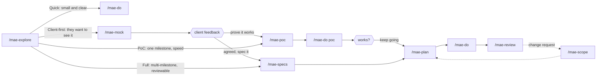

<div align="center">


### Spec-driven delivery for AI coding tools.

Your AI tool forgets everything between chats. Maestro keeps requirements, design, decisions, and tasks in your repo as files — so every session picks up where the last one ended.

[](LICENSE)
[](CHANGELOG.md)
[](#multi-tool-support)

[Install](#install) · [Paths](#pick-a-path) · [Commands](#commands) · [PoC track](#the-poc-track) · [How it works](#how-it-works) · [Docs](docs/user-guide.md)

</div>

---

## The problem

AI coding tools have no memory of your project between chats. Every session starts the same way: re-explaining the architecture, re-litigating decisions you already made, watching the model rebuild context you paid for yesterday. Decisions live in scrollback. Nothing is auditable.

**Maestro fixes this with files, not magic.** A small set of commands writes structured artifacts to disk — requirements, architecture, roadmap, tasks, decisions — and a handoff file the agent reads at the start of every session. Your AI tool picks up where it left off because the context is on disk, not in a context window.

```bash
curl -fsSL https://raw.githubusercontent.com/pjasielski/maestro/main/install.sh | bash
```

> [!NOTE]
> **Trying v0.5.0 before its release?** From your project folder:
> `MAESTRO_BRANCH=release/v0.5.0 bash -c 'curl -fsSL "https://raw.githubusercontent.com/pjasielski/maestro/$MAESTRO_BRANCH/install.sh" | bash'`
> — see [Installing from a branch or tag](docs/installation.md#installing-from-a-branch-or-tag).

> [!TIP]
> Maestro is prompts and markdown. No daemon, no API key, no vendor lock-in — delete `MAESTRO.md` and `.maestro/` and your project is exactly as it was.

## What a session looks like

```
/mae-help             What should I run now? One suggestion, from what's on disk
/mae-explore          Build understanding — analyze docs, code, transcripts → EXPLORE.md
/mae-specs            Requirements, visual design (if there's a UI), architecture — whatever is missing
/mae-plan             Roadmap and task files
/mae-do M02.03        Execute a task; commits it, never pushes
/sync                 End of session — update HANDOFF, ROADMAP, DECISIONS
```

Next week, in a brand-new chat, the agent reads `HANDOFF.md` first and greets you with where you left off. That's the whole idea.

## Pick a path

Not every project needs every command. Each has a `## Skip When` section; the agent suggests, it never blocks.



| Path | Use it when | Commands |
|------|-------------|----------|
| **Quick** | Small, clear, one sitting | `explore → do` |
| **Client-first** | The client needs to see something before agreeing | `explore → mock → [client] → poc or specs → plan → do` |
| **PoC** | One milestone, speed over reviewability | `explore → poc → do poc` → `plan` for M02 if it works |
| **Full** | Several milestones, reviewed specs | `explore → specs → plan → do → review`, changes through `scope` |

## The PoC track

Sometimes the full pipeline costs more than it returns. A prototype, a spike, a time-boxed build where you need to be writing code in twenty minutes, not reviewing three documents.

`/mae-poc` collapses requirements, architecture, and roadmap into **one file** — `docs/02-specs/POC.md` — and `/mae-do poc` executes straight from it.

```
/mae-explore          Understand the problem (or skip, if a brief already exists)
/mae-poc              One spec: scope, requirements, architecture, roadmap, risks
/mae-do poc           Execute the whole milestone
```

Why one file rather than three: the agent reads **once**. Three artifacts means three reads and three chances to miss one. The PoC spec is capped at 4,000 words on purpose — past that it isn't a PoC, and the command says so and offers to split into the full track.

It asks only blocking questions — stack, data source, deployment target — and records every other judgement call under **§ Risks & Assumptions** instead of stopping to ask. Speed is the point.

**When the prototype survives**, nothing is thrown away. The PoC is milestone `M01`, using the same task IDs as everything else, so `/mae-plan` simply continues at `M02` and the PoC's history stays intact as the project's first milestone.

> [!TIP]
> **`docs/00-reference/` — the material you didn't write.**
> Drop client briefs, specs, and transcripts here before you start. Maestro treats this folder as read-only and **authoritative on intent** — it outranks anything the agent infers from reading your code. When someone hands you a brief and a deadline, this is where the project begins.

## Install

```bash
curl -fsSL https://raw.githubusercontent.com/pjasielski/maestro/main/install.sh | bash
```

The installer asks five questions (session visibility, AI tools, how to ask you questions, when to commit, which responses to save as files), scaffolds `docs/`, and writes adapters for the tools you picked. **It never overwrites your files** — `HANDOFF.md`, `DECISIONS.md`, `CLAUDE.md`, and `maestro.toml` are preserved on reinstall.

Upgrading from an earlier version, or want the framework files refreshed:

```bash
curl -fsSL https://raw.githubusercontent.com/pjasielski/maestro/main/install.sh | bash -s -- . --force
```

Upgrades keep your files and existing `maestro.toml` keys, and add any keys that are new. A pre-0.5.0 `docs/` layout is detected; run `/mae-init upgrade` in your agent to move it.

→ **[Full installation guide](docs/installation.md)** — install from a branch or tag, manual install, Cursor setup, teams, troubleshooting

## Commands

Every delivery command has a short alias. `/mae-help` tells you which one matters now; `/mae-help all` lists everything.

| Command | Alias | What it does | Writes to |
|---------|-------|--------------|-----------|
| `/mae-explore` | `mex` | Build understanding; surface questions and gaps | `docs/01-explore/` (`EXPLORE.md`) |
| `/mae-idea "…"` | — | Park a maybe-later idea without interrupting the work | `docs/01-explore/IDEAS.md` |
| `/mae-specs [part]` | `msp` | Build the missing spec parts in one question round | `docs/02-specs/` |
| `/mae-requirements` | `mrq` | What to build and why (client signs) | `docs/02-specs/REQUIREMENTS.md` |
| `/mae-design` | `mds` | Visual system: colours, type, components | `docs/02-specs/DESIGN.md` |
| `/mae-architecture` | `mar` | How it's built, with trade-offs written down | `docs/02-specs/ARCHITECTURE.md` |
| `/mae-mock` | — | Clickable, self-contained HTML screens to show a client | `docs/02-specs/mock/` |
| `/mae-poc` | `mpoc` | One-file spec for prototypes and time-boxed builds | `docs/02-specs/POC.md` |
| `/mae-scope` | `msc` | Scope change: impact analysis, applied on confirmation | session → specs, roadmap |
| `/mae-plan` | `mpl` | Roadmap and task files | `docs/03-plan/` |
| `/mae-do` | `mdo` | Execute a task, planned or ad-hoc; commits per task | code + `docs/04-implementation/` |
| `/mae-review` | `mrv` | Review code or delivery artifacts | `docs/05-review/` |
| `/mae-pr` | — | Push the branch and open a draft PR (only when you type it) | remote |
| `/mae-init` | — | Profile setup; `upgrade` migrates a pre-0.5.0 layout | `maestro.toml` |
| `/mae-help` | — | What to run now, from what's on disk | — |

| Utility | What it does |
|---------|--------------|
| `/status` | Project overview — phase, tasks, decisions, open questions |
| `/decide` | Record a decision in the audit trail |
| `/sync` | End-of-session save — HANDOFF, ROADMAP, DECISIONS |
| `/md` | Save the previous response to a session file, verbatim |

<details>
<summary><b>Sub-commands and variants</b></summary>

| Command | What it does |
|---------|--------------|
| `/mae-explore ask` | Questions for you, the client, or the team, grouped Business / Technical, pre-filled where safe |
| `/mae-explore doc` | Synthesize `EXPLORE.md`, the one explore file other commands read |
| `/mae-explore I-07` | Explore a parked idea |
| `/mae-specs architecture {component}` | One component, in `architecture/{component}.md` |
| `/mae-mock {screen}` | Regenerate one screen |
| `/mae-scope --direct "…"` | Apply additive changes without asking; conflicts still stop |
| `/mae-poc --tasks` | Also emit individual task files, not just the roadmap table |
| `/mae-do poc` | Execute the whole PoC milestone from `POC.md` |
| `/mae-do M02.03` | Execute one planned task |
| `/mae-init upgrade` | Move a pre-0.5.0 `docs/` layout to the current one, after you confirm |
| `/mae-help all` | Every command, grouped by phase, with what it produces |
| `/mae-help {command}` | One command: when to use it, when to skip it, what it reads and writes |
| `/status --graph` | Print the milestone map and task dependency graph |

</details>

<details>
<summary><b>Running several phases in one go</b></summary>

Once you know the flow, you can chain phases. A chain asks all its questions **once** at the start, has **one** review after the last spec phase, and commits every task inside `do`.

```
/mae-run requirements..plan              requirements → design (if UI) → architecture → roadmap, one interruption
/mae-specs -> /mae-plan                  the same, written out
/mae-run architecture..do M02            through to implementation of milestone M02
/mae-yolo [stop]                         from wherever you are to `stop` (default: do)
```

What a chain never does: skip explore, promote to `docs/` without your review, continue after a failed task, or push.

</details>

## When the scope changes

It will. `/mae-scope` takes the change — a sentence, or a file you dropped into `docs/00-reference/` — and classifies each part:

| Kind | What happens |
|---|---|
| **Additive** | New requirements and tasks; nothing existing changes |
| **Modifying** | Existing requirements, architecture, or tasks change — each is listed |
| **Conflicting** | Contradicts a recorded decision — you resolve it before anything is applied |

It writes a `scope-delta.md` you can send to a client as-is, then applies only what you approve across the specs, ROADMAP and tasks. In a hurry? `/mae-scope --direct …` applies the additive parts straight away and still stops on anything that changes or contradicts what you decided. Anything you don't approve is parked in `docs/01-explore/IDEAS.md`, not lost. A change too big to classify is sent to `/mae-explore` first.

```
/mae-scope "client wants multi-currency and an approvals queue"
/mae-scope docs/00-reference/change-request-2.md
```

## How it works

### Sessions are a workbench; `docs/` is the record

Commands write drafts to `.sessions/`. You review. Confirmed work gets **promoted** to `docs/`.

```
/mae-explore doc   → explore synthesis  ──promote──→  docs/01-explore/EXPLORE.md
/mae-specs         → spec drafts        ──promote──→  docs/02-specs/REQUIREMENTS.md, DESIGN.md, ARCHITECTURE.md
/mae-mock          → HTML screens       ──────────→  docs/02-specs/mock/
/mae-poc           → POC spec           ──────────→  docs/02-specs/POC.md
/mae-plan          → roadmap + tasks    ──────────→  docs/03-plan/
```

Only reviewed artifacts reach `docs/`, so `docs/` stays trustworthy — which is what makes it safe for the agent to treat as canonical. (`/mae-plan`, `/mae-poc` and `/mae-mock` write straight through: their output is immediately actionable, so a review round-trip would only cost you time.)

### Nothing falls through the cracks

```
OPEN_QUESTIONS.md  →  DECISIONS.md  →  Canonical files
"should we?"          "we decided"     (via /sync)
```

### Creating is free; editing is reviewed

The agent writes new files and session material without asking. Editing `docs/`, `HANDOFF.md`, source code, or `maestro.toml` requires showing you the change first. That single rule is what keeps an eager model from quietly rewriting your architecture.

<details>
<summary><b>What the installer puts in your project</b></summary>

```
your-project/
├── MAESTRO.md                ← Framework instructions (don't edit)
├── CLAUDE.md                 ← Your project config (edit this)
├── maestro.toml              ← Settings: visibility, tools, [git], response_capture, profile
├── maestro.local.toml        ← Optional personal overrides (gitignored; may only tighten [git])
├── HANDOFF.md                ← Single source of truth for status
├── DECISIONS.md              ← Decision audit trail
├── OPEN_QUESTIONS.md         ← Questions needing answers
├── WORKLOG.md                ← Activity log
├── docs/
│   ├── 00-reference/         ← Material you didn't write (read-only)
│   ├── 01-explore/           ← EXPLORE.md (synthesis), IDEAS.md, explore artifacts
│   ├── 02-specs/             ← REQUIREMENTS.md, DESIGN.md, ARCHITECTURE.md, mock/ — or POC.md (PoC track)
│   ├── 03-plan/              ← ROADMAP.md + tasks/
│   ├── 04-implementation/    ← Reports from /mae-do
│   ├── 05-review/            ← Review reports        (on demand)
│   ├── 06-test/              ← Test plans            (on demand)
│   ├── 07-deploy/            ← Deployment config     (on demand)
│   └── 08-maintenance/       ← Bugs, tech debt       (on demand)
├── .sessions/                ← Working material, per session
├── .maestro/templates/       ← Document templates (customizable)
├── .maestro/skills/          ← Skills the agent may offer (explore, specs, scope, idea, mock)
├── .maestro/commands/        ← Canonical command definitions
├── .claude/                  ← Claude Code: skills + command wrappers and aliases
└── .agents/skills/           ← Skills for Cursor and Codex
```

A phase command is named after its folder: `/mae-explore` → `01-explore/`, `/mae-specs` → `02-specs/`, `/mae-plan` → `03-plan/`.

</details>

## Configuration

Everything lives in `maestro.toml`.

```toml
[project]
name = "my-project"
session_visibility = "committed"   # or "gitignored"
question_style = "async"           # or "sync"
ai_tools = ["claude", "cursor"]
response_capture = "artifacts"     # or "minimal", "all"

[git]
commit = "task"                    # or "milestone", "never"
push = "never"                     # or "milestone"
branch = "milestone"               # or "never"
pr = "markdown"                    # or "off", "milestone"
merge = "never"
```

| Setting | Options | Effect |
|---------|---------|--------|
| `session_visibility` | `committed` / `gitignored` | Whether `.sessions/` is in git. Committed suits solo projects; gitignored suits teams where sessions are personal |
| `question_style` | `async` / `sync` | `async` writes questions to a file you answer in your own time; `sync` asks in chat |
| `ai_tools` | `claude`, `cursor`, `copilot`, `codex` | Which adapters get generated |
| `response_capture` | `artifacts` / `minimal` / `all` | Files for work products only (default), for docs promotions and explore only, or for every response. `/md` saves anything on demand |
| `[git]` | see comments | Commit per task by default; never push unless you set it; PR description written as markdown; any PR is a draft. `maestro.local.toml` may only tighten it |

Keys added in a newer version are appended on upgrade; a missing key uses its default.

<details>
<summary><b>Optional: user and team profiles</b></summary>

Tell Maestro what you're good at and it calibrates — deeper explanation where you need it, leaner where you don't.

```toml
[user]
description = "Senior Python architect, new to frontend"
strengths = ["backend", "python"]
needs_help = ["frontend", "ux"]
```

Defining `[[team.members]]` activates team behaviour: the agent asks who it's working with and adapts per person.

```toml
[[team.members]]
name = "Piotr"
role = "architect"
strengths = ["backend", "python"]
needs_help = ["frontend"]
```

</details>

## Templates

Every artifact is generated from a markdown template in `.maestro/templates/`. Edit them to match your standards — the framework uses whatever is there.

| Template | Produces |
|----------|----------|
| `requirements.md` | `REQUIREMENTS.md` |
| `design.md` | `DESIGN.md` (visual system) |
| `architecture.md` | `ARCHITECTURE.md` |
| `poc.md` | `POC.md` |
| `roadmap.md` | `ROADMAP.md` |
| `task.md` | `tasks/M{MM}.{NN}-{slug}.md` |
| `explore.md` · `review.md` · `report.md` | Session artifacts |
| `summary.md` | `_summary.md` |
| `issue.md` | `docs/08-maintenance/issues/` |

## Multi-tool support

Each protocol lives once, in `.maestro/skills/` or `.maestro/commands/`. Each tool gets a thin adapter pointing at it — so a command behaves identically everywhere, and adding a tool never means rewriting prompts.

| Tool | Adapter | Usage |
|------|---------|-------|
| **Claude Code** | `.claude/skills/` + `.claude/commands/` | `/mae-explore` or `/mex` — autocomplete works; skills can also be offered by the agent |
| **Cursor** | `.cursor/rules/` + `.cursor/commands/` + `.agents/skills/` | Type `mae-explore` or `mex` in chat |
| **Copilot / Codex** | `.github/copilot-instructions.md` | Type the command name in chat |

## FAQ

<details>
<summary><b>So it's just prompts?</b></summary>

Yes. That's the point — nothing to run, nothing to host, nothing to migrate off. The value isn't in a runtime; it's in the artifacts landing in your repo in a shape the next session can read.

</details>

<details>
<summary><b>Why not just write good prompts?</b></summary>

You can, and for a one-off script you should. Maestro earns its keep when a project outlives a single context window — when you need to know *why* a decision was made three weeks ago, or hand the project to someone else, or resume after a month away. It's the difference between a conversation and a record.

</details>

<details>
<summary><b>This looks heavy for a prototype.</b></summary>

Then use the [PoC track](#the-poc-track): `explore → poc → do`, one spec file, no promotion round-trips. Or just `explore → do`. And if what feels heavy is the number of files: set `response_capture = "minimal"` and Maestro saves only what ends up in `docs/` plus explore notes.

</details>

<details>
<summary><b>Does the agent leave servers running?</b></summary>

It tells you. Whenever it starts a long-running process, its report ends with the process, port, pid and the command to stop it, and says whether it left it up on purpose. `/sync` reports anything still running from the session. The project README's `## Quickstart` is kept true — updated in the same task that changes a port, entry point, env var or dependency. The full pipeline is there when a project earns it, not before.

</details>

<details>
<summary><b>Does this lock me in?</b></summary>

No. Maestro is markdown files in your repo. There's no runtime, no service, no account. If you stop using it, you're left with well-organized project documentation — which was worth having anyway.

</details>

<details>
<summary><b>Do I have to use all the docs folders?</b></summary>

No. `04` through `08` stay empty until needed — your first bug, or the first time deployment gets non-trivial. A small project may never leave `01`–`03`, and a PoC may only ever touch `00`, `02-specs` (POC.md), and `04`.

</details>

<details>
<summary><b>Can I use it on an existing project?</b></summary>

Yes — that's what `/mae-explore` is for. Point it at a codebase and it builds the understanding artifacts from what's already there, rather than assuming a greenfield start.

</details>

## Requirements

- An AI coding tool: [Claude Code](https://claude.com/claude-code), [Cursor](https://cursor.sh), or GitHub Copilot
- A project directory

## Documentation

| Guide | Contents |
|-------|----------|
| [Installation](docs/installation.md) | One-line install, branches and tags, upgrades, manual install, per-tool setup, troubleshooting |
| [User guide](docs/user-guide.md) | Working through a project phase by phase |
| [Reference](docs/reference.md) | Every command, flag, and config key |
| [Changelog](CHANGELOG.md) | Version history |

## License

MIT
