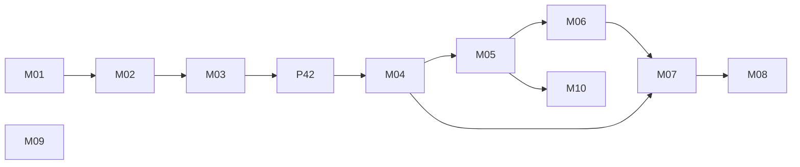
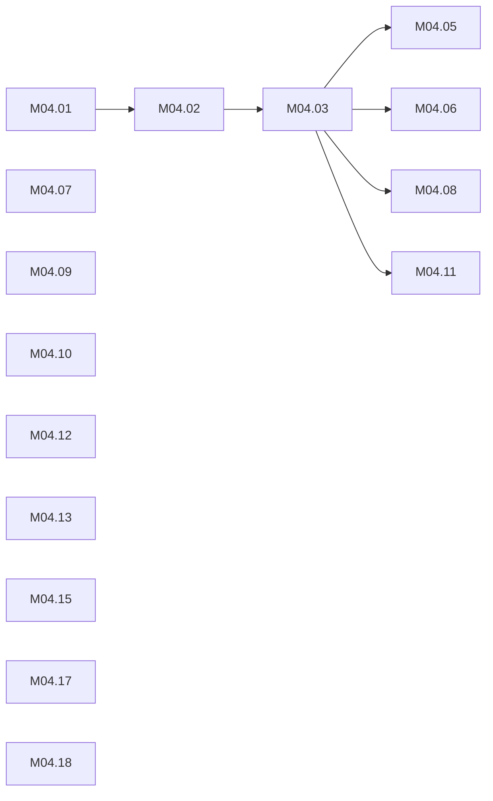

# ROADMAP — Maestro Framework

**Version:** v0.4.0 (current release — tags v0.1.0 / v0.2.0 / v0.3.0 / v0.4.0 match CHANGELOG)
**Next release:** v0.4.2 (behavior patch — see below), then v0.5.0 (Milestone M04 — skill-first architecture)
**Updated:** 2026-08-21
**Sources:** Sessions 005, 006, 009, 010, 012, 014 (competition), 015 (skills), 017 (interview — PoC field test), 018 (reconciliation), 22-new-scope (developer critique)
**Note:** Renumbered 2026-07-18 to unified IDs (D23): `M{MM}.{NN}`, identical in ROADMAP, task filenames (`M{MM}.{NN}-{slug}.md`), and task titles.
**Note:** Renumbered again 2026-08-03 — see "Renumbering 2026-08-03" at the foot of this file. PoC workflow shipped early as M03/v0.4.0; skills moved to M04 and everything between shifted by one. Session notes dated before 2026-08-03 use the old numbering.

---

## Milestone Map
<!-- deps:map -->

<!-- /deps:map -->

---

## Milestone M01: Foundation & Stability (v0.2.0) — ✅ complete

All 12 items done (installer rework, `.sessions/` standardization, session visibility, tracking files, renames PRD→REQUIREMENTS / SDD→DESIGN, aliases, sync absorption, Cursor adapters). Details in git history and CHANGELOG (was "Milestone 1").

## Milestone M02: Installer & Restructure (v0.3.0) — ✅ complete

All 8 items done (installer questions, conditional adapters, delivery/→docs/, templates→.maestro/, MAESTRO_BRANCH, --force, migration cleanup, toml settings). (Was "Milestone 1.5".)

---

## Milestone M03: PoC Workflow (v0.4.0) — ✅ shipped 2026-08-03 · was M07

Time-boxed delivery track: one spec file instead of three, plus `docs/00-reference/` for source material the user did not write. Pulled forward from v0.8.0 and shipped early — validated under real delivery conditions during a live engagement (session 017) before release.

| # | Item | Priority | Effort | Depends | Status | Task | Source |
|---|------|----------|--------|---------|--------|------|--------|
| M03.01 | **`/mae-poc` orchestrator: req+design+roadmap in one `docs/02-poc/POC.md`; graduation to full track via `/mae-plan` at M02** | P1 | M | — | ✅ done | — | 015/017 |
| M03.02 | **`docs/00-reference/` — read-only source material, authoritative over inferences from code; read first by `/mae-explore`** | P1 | S | — | ✅ done | — | 017 |
| M03.03 | **`/mae-do poc` — execute a whole PoC milestone from POC.md** | P1 | S | M03.01 | ✅ done | — | 015/017 |
| M03.04 | **Context-loading tiers for PoC spec + PoC implementation (MAESTRO.md)** | P2 | S | — | ✅ done | — | 005/009 |
| M03.05 | **PoC track in MAESTRO.md: workflow paths, artifact flow, adaptive guidance, `.maestro/templates/poc.md`** | P1 | S | M03.01 | ✅ done | — | 015/017 |
| M03.06 | **Installer hotfix: honor gitignored visibility when .gitignore already exists (append, idempotent; warn on committed-but-ignored conflict)** | P1 | S | — | ✅ done | [M03.06](tasks/M03.06-installer-gitignore-visibility.md) | 2026-07-19 field report |

**Done when:** ✅ A time-boxed build runs `explore → poc → do` end to end from a single spec file, and graduates to the full track without losing history.

**Shipped, with these caveats carried forward:**
- `poc` flag on the *other* delivery commands was not built — only `/mae-do poc` exists (→ M04.11)
- Graduation via delta merge (the original M07.02 intent) depends on living-docs; graduation currently works by `/mae-plan` continuing at M02 (→ M05)
- Post-do state sync and definition-of-done were not built (→ M04.12, M04.13)
- `mae-spec` (old M03.04) is **⊘ dropped** — `/mae-poc` is that command (session 017/13 argued explicitly against building both)

---

## Patch v0.4.2: Behavior Fixes from Developer Critique — ← NEXT · branch `feat/v0.4.2-scope`

Six small behavior changes to command *content*, shipped before the skill conversion so M04 converts final behavior rather than converting twice. All items are S. Source: session 22-new-scope, driven by critique from two external developers.

**Why before M04:** `015-skills/03-skills-files.md` flagged the dependency explicitly — *"these conventions should be settled before the WS1 skill conversion."* Rewriting a command then converting it is one rewrite; converting then rewriting is two.

| # | Item | Priority | Effort | Depends | Status | Task | Source |
|---|------|----------|--------|---------|--------|------|--------|
| P42.01 | **`[git]` config block + per-task commits: commit/push/branch/pr/merge settings; defaults commit=task, push=never, branch=milestone (asks once), merge=never; agent reports git actions** | P1 | S | — | ☐ todo | [P42.01](tasks/P42.01-git-settings.md) | 22 §3 |
| P42.02 | **`response_capture` = all \| artifacts (default) \| minimal; replace the "> 80 words" rule with a work-product rule; define the artifact per command** | P1 | S | — | ☐ todo | [P42.02](tasks/P42.02-response-capture.md) | 22 §1, 015/03 |
| P42.03 | **Merge req/design double-save into one artifact with a report header; `/md` two-mode semantics; "link + one sentence, never duplicate the file in chat" as a global rule** | P1 | S | P42.02 | ☐ todo | [P42.03](tasks/P42.03-artifact-consolidation.md) | 22 §1 |
| P42.04 | **Append-only session summary + decision log; two zones (curated top / log bottom); compact and reconcile at `/sync` with contradiction flagging** | P1 | S | — | ☐ todo | [P42.04](tasks/P42.04-append-only-state.md) | 22 §6a |
| P42.05 | **`/mae-do`: generated README gets a verified `## Quickstart`; report running processes with stop instructions; `## Running Processes` in `_summary.md`, checked at `/sync`** | P1 | S | — | ☐ todo | [P42.05](tasks/P42.05-readme-and-processes.md) | 22 §10 |
| P42.06 | **Explore question pre-filling: consequence-based rule, three markers, working-default-on-open, technical vs. business-logic audience split** (was M04.14 — earmarked for v0.4.1 and never shipped) | P2 | S | — | ☐ todo | [P42.06](tasks/P42.06-explore-prefill.md) | 018/05 |
| P42.07 | **PoC graduation: `/mae-plan` accepts POC.md and requirements-only planning** | P1 | XS | P42.09 | ☐ todo | [P42.07](tasks/P42.07-poc-graduation.md) | 018 §1.1 |
| P42.08 | **Installer fixes: local-mode detection, `issue.md` download, append missing `maestro.toml` blocks; v0.5.0 lists; clean-install test** | P1 | S | P42.09 | ☐ todo | [P42.08](tasks/P42.08-installer-fixes.md) | hq 22/11 §5 |
| P42.09 | **Canonical layout (`02-specs/`, `03-plan/`, `EXPLORE.md`, main-file rule) + command names (`/mae-requirements`, `/mae-architecture`, visual `/mae-design`, `/mae-specs`)** | P1 | L | — | ☐ todo | [P42.09](tasks/P42.09-layout-and-commands.md) | hq 22/15, 18 |
| P42.10 | **`/mae-idea` — append-only idea inbox `01-explore/IDEAS.md`; parks, never asks** | P2 | XS | P42.09 | ☐ todo | [P42.10](tasks/P42.10-mae-idea.md) | hq 22/15 §7 |
| P42.11 | **`/mae-pr` — push the current branch, open a draft PR (compare-URL fallback)** | P3 | S | P42.01 | ☐ todo | [P42.11](tasks/P42.11-mae-pr.md) | hq 22/14 §4, 15 §8 |

**Done when:** A developer who dislikes file noise can set `response_capture = "minimal"` in `maestro.local.toml` and get a chat-first experience without losing canonical artifacts; commits happen per task with task-ID messages; no generated README lies about how to run the app.

**Note on IDs:** `P42.NN` (patch 0.4.2) rather than `M{MM}.{NN}` — these are not a milestone and should not consume a milestone number. The prefix keeps them sortable and greppable alongside task files.

---

## Milestone M04: Skill-First Architecture (v0.5.0) — was M03 · branch `milestone/m04-skill-first`

Commands become skills per the Agent Skills open standard (D17, D22, D23). Includes installer hotfixes from field reports (Windows, TTY) — not skills work, but they ship with v0.5.0.

**Note:** the migration set is now **eleven** commands, not ten — `/mae-poc` shipped in v0.4.0 and converts along with the rest.

| # | Item | Priority | Effort | Depends | Status | Task | Source |
|---|------|----------|--------|---------|--------|------|--------|
| M04.01 | **Spike: mae-explore as SKILL.md, test auto-trigger (Claude Code + one non-Claude tool)** | P1 | M | — | ⏳ blocked | [M04.01](tasks/M04.01-skill-spike.md) | 015 |
| M04.02 | **Frontmatter convention: tiers (auto/suggest/explicit), trigger + anti-trigger phrases** | P1 | S | M04.01 | ✅ done | [M04.02](tasks/M04.02-frontmatter-convention.md) | 015 |
| M04.03 | **Convert all remaining commands to skills (incl. `/mae-poc`); templates as supporting files** | P1 | L | M04.02 | ☐ todo | [M04.03](tasks/M04.03-convert-commands-to-skills.md) | 015 |
| M04.05 | **`mae-prd` / `mae-sdd` alias skills with synonym descriptions** | P2 | S | M04.03 | ☐ todo | [M04.05](tasks/M04.05-prd-sdd-aliases.md) | 015 |
| M04.06 | **Installer: place skills per tool; retire .cursor dispatch where skills suffice** | P1 | M | M04.03 | ☐ todo | [M04.06](tasks/M04.06-installer-skill-placement.md) | 015 |
| M04.07 | **Layered config: maestro.local.toml (gitignored personal prefs) + response_capture/question_budget settings** | P1 | S | — | ☐ todo | [M04.07](tasks/M04.07-layered-config.md) | 015 |
| M04.08 | **Question-budget rules in req/design/plan (explore exempt)** | P2 | S | M04.03 | ☐ todo | [M04.08](tasks/M04.08-question-budget.md) | 015 |
| M04.09 | **Installer hotfix: Windows story — document Git Bash/WSL requirement, evaluate install.ps1 (interim until M06 CLI)** | P1 | S | — | ☐ todo | [M04.09](tasks/M04.09-installer-windows-support.md) | 015/08 field report |
| M04.10 | **Installer hotfix: graceful non-interactive fallback — detect missing/unreadable /dev/tty, announce defaults loudly, clarify reinstall skips questions** | P1 | S | — | ☐ todo | [M04.10](tasks/M04.10-installer-tty-fallback.md) | 015/08 field report |
| M04.11 | **`poc` flag on the remaining delivery commands (carried from M03)** | P2 | M | M04.03 | ☐ todo | — | 005 |
| M04.12 | **Post-do state sync (checklist or required /sync) (carried from M03)** | P2 | S | — | ☐ todo | — | 009 |
| M04.13 | **Definition of done: acceptance criteria checked before status → done (carried from M03)** | P2 | S | — | ☐ todo | [M04.13](tasks/M04.13-definition-of-done.md) | 009 |
| M04.14 | ⊘ **Explore question pre-filling — moved to P42.06 (v0.4.2 patch)** | — | — | — | ⊘ moved | — | 018 |
| M04.15 | **`/mae-help` — state-aware next-step suggestion; `/mae-help {command}`; shows 3 relevant commands, not 11. Build FIRST in this milestone** | P1 | S | — | ✅ done | [M04.15](tasks/M04.15-mae-help.md) | 22 §4 |
| M04.16 | *(vacant — held both aliases; `/mae-arch` promoted to M05.12 as primary name, `/mae-spec` dropped as unnecessary once chaining exists)* | — | — | — | ⊘ vacant | — | 22 §2, §7 |
| M04.17 | **`/mae-approve` (triage-only): read inline comments, show interpretation table, wait for confirmation. No stamping — that's M05.10** | P2 | S | — | ☐ todo | [M04.17](tasks/M04.17-mae-approve-triage.md) | 22 §8 |
| M04.18 | **Dependency graph (Mermaid) emitted by `/mae-plan` into ROADMAP.md; milestone-level graph at file head** | P2 | S | — | ✅ done | [M04.18](tasks/M04.18-dependency-graph.md) | 22 §5 |

**Done when:** Every command is a standard skill; auto-trigger works for advisory tier; install works on ≥ 3 tools; personal preferences respected; Windows install path documented and non-interactive installs are explicit about defaults. (Artifact-capture rule + task-ID convention already landed 2026-07-14: D22, D23.)

**Build order note:** M04.15 (`/mae-help`) first — its state table ("user is at state X, skill Y is relevant") *is* the auto-trigger heuristic that M04.02's frontmatter convention must encode. Building it first gives M04.02 a tested state machine instead of a guess.

**Note:** M04.04 is intentionally vacant — it was `mae-spec`, dropped as superseded by `/mae-poc`. M04.16 is now also vacant. Numbering preserved so pre-2026-08-03 session notes stay resolvable.

**Branch note (2026-08-21):** `milestone/m03-skill-first` contains **nothing** — zero commits ahead of main, zero file differences. It appears in `git branch --merged` only because its tip is an ancestor of main. No skills work was ever written on it. Create `milestone/m04-skill-first` fresh; do not reuse.

### Dependencies
<!-- deps:M04 -->

<!-- /deps:M04 -->

## Milestone M05: Living Docs & Sync (v0.6.0) — was M04

Canonical docs stay current transactionally (D19, D20, D21).

| # | Item | Priority | Effort | Depends | Status | Task | Source |
|---|------|----------|--------|---------|--------|------|--------|
| M05.01 | **Delta format for canonical docs (ADDED/MODIFIED/REMOVED)** | P1 | M | — | ☐ todo | — | 014 |
| M05.02 | **/sync merge step — archive behavior for deltas** | P1 | M | M05.01 | ☐ todo | — | 014 |
| M05.03 | **Capability sharding: requirements + design (_overview.md + per-capability files)** | P1 | M | — | ☐ todo | — | 015 |
| M05.04 | **Mechanical drift report in /sync (unmerged deltas)** | P2 | S | M05.02 | ☐ todo | — | 014 |
| M05.05 | **PoC graduation via delta merge (carried from M03 — currently graduates by `/mae-plan` at M02)** | P2 | M | M05.02 | ☐ todo | — | 015/018 |
| M05.06 | **ADR supersession lifecycle: superseded-by graph, ADR ↔ DESIGN.md drift reporting in /sync** | P1 | M | M05.02, M04 ADR migration | ☐ todo | — | 018 (hq 11 §3) |
| M05.07 | **`/mae-scope` — scope-change intake: intake → classify (additive/modifying/conflicting) → `scope-delta.md` impact analysis → apply on confirmation. Emits ADRs for conflicts; consumes partial approval from `/mae-approve`; detects when the change is large enough to warrant `/mae-explore` first** | P1 | M | M05.01 (soft) | ✅ done | [M05.07](tasks/M05.07-mae-scope.md) | 018 (absorbs F.6), 22 §9 |
| M05.07a | **`/mae-scope --direct`: delta file still written; additive applied without asking; modifying/conflicting still stop** | P2 | XS | M05.07 | ☐ todo | [M05.07a](tasks/M05.07a-scope-direct.md) | hq 22/11 §A4 |
| M05.08 | **Canonical-file consolidation: OPEN_QUESTIONS → HANDOFF section; delete WORKLOG (git log with task-ID messages replaces it); DECISIONS → `adr/_index.md`; add ADR index to context-loading for Design/Implementation/Review; mechanical staleness reporting in `/sync`** | P1 | M | M05.06 | ☐ todo | — | 22 §6b |
| M05.09 | **`/mae-mock` — standalone HTML mockups, self-contained, `_screens.md` index mapping screens to requirements; one destination `02-specs/mock/`; born as a skill** | P1 | M | P42.09, M04.03 | ☐ todo | [M05.09](tasks/M05.09-mae-mock.md) | 22 §7, hq 22/11 §A5, 15 §5 |
| M05.10 | **`/mae-approve` full: frontmatter approval stamp; approved sections are never silently regenerated — conflict flagged instead** | P2 | S | M04.17, M05.01 | ☐ todo | — | 22 §8 |
| M05.11 | **`/mae-run {a}..{b}` chaining + `->` syntax + `/mae-yolo [stop-phase]`: one question round at the front, one review at the end; never skips explore; commits per task** | P1 | M | P42.01 (soft) | ✅ done | [M05.11](tasks/M05.11-run-chaining-yolo.md) | 22 §2 |
| M05.12 | **⚠️ DECISION-GATED — design/architecture naming + phase placement.** Needs its own session before any task spec exists. `/mae-arch` as primary with `/mae-design` alias (research: Anthropic shipped `frontend-design`, not `design`; Kiro/spec-kit keep `design.md` for architecture). Artifact names stay. Decide before M05.09 | P1 | S | — | ⏳ blocked (needs decision session) | — | 22 §7 |
| M05.13 | **Parallel-work view: ready-now vs. blocked, with file-overlap conflict warnings derived from task acceptance criteria** (promoted from M10 — 8-person team test upcoming) | P2 | M | M04.18 | ☐ todo | — | 22 §5 |

**Done when:** Shipping a change updates canonical docs as part of /sync; drift is reported, not noticed; a mid-project scope addition lands in every canonical file without hand-editing; the root holds one tracking file instead of four.

**Sprint note (2026-09-14):** M05.07 and M05.11 were pulled forward into the September sprint — the M04.03 dependency on M05.11 was wrong (chaining orchestrates commands as well as skills; the v0.4.2 build-behavior-before-packaging rule applies). Sprint allocation by model tier: `maestro-hq/.sessions/22-new-scope/05-fable-tiered-scope.md`.

**Design-together note:** M05.06 (ADR supersession), M05.07 (`/mae-scope`), and M05.10 (`/mae-approve` stamping) are three faces of one mechanism — a decision changes and canonical docs must follow. Design them in one pass or you will build three overlapping audit trails, which is the exact failure DECISIONS.md already demonstrated.

## Milestone M06: CLI (v0.7.0) — was M05

Deterministic = CLI, judgment = skills. CLI automates, never gates.

| # | Item | Priority | Effort | Depends | Status | Task | Source |
|---|------|----------|--------|---------|--------|------|--------|
| M06.01 | **`maestro validate` — structure checks (docs, tasks, toml, SKILL frontmatter, ADR index ↔ files)** | P1 | L | M04, M05 formats | ☐ todo | — | 014 |
| M06.02 | **`maestro init` / `update` — scaffold, skill placement, migrations (cross-platform: replaces install.sh, closes the Windows gap for good)** | P1 | L | M06.01 | ☐ todo | — | 014 |
| M06.03 | **PyPI package `maestro-delivery` (pip/uvx)** | P1 | M | M06.02 | ☐ todo | — | 009/014 |

**Done when:** `uvx maestro init` works end-to-end on macOS, Linux, and Windows; validate runs in CI. (Absorbs old F.2.)

## Milestone M07: Interop & Distribution (v0.8.0) — was M06

| # | Item | Priority | Effort | Depends | Status | Task | Source |
|---|------|----------|--------|---------|--------|------|--------|
| M07.01 | **README rewrite: "idea → shipped", PM persona, works-with-OpenSpec** | P1 | M | — | ✅ done | — | 014/018 |
| M07.02 | **mae-plan export to OpenSpec change folder** | P2 | M | M04 | ☐ todo | — | 014 |
| M07.03 | **Publish mae-explore skill on skills.sh** | P2 | S | M04.01 | ☐ todo | — | 015 |

(M07.01 landed with v0.4.0: logo, positioning per session 010 marketing analysis, PoC track section, `00-reference` explanation. OpenSpec interop claims deliberately omitted until M07.02 ships.)

## Milestone M08: Documentation & Onboarding (v0.9.0) — was Milestone 3

| # | Item | Priority | Effort | Depends | Status | Task | Source |
|---|------|----------|--------|---------|--------|------|--------|
| M08.01 | **Rework mae-init: profile-only (conversational), skip folder creation** | P1 | M | — | ☐ todo | — | 005 decision |
| M08.02 | **Create tool capability matrix (`docs/tool-support.md`)** | P1 | S | — | ☐ todo | — | 005/009 review |
| M08.03 | **Update README.md to reflect installer, convention, and workflow changes (partially absorbed by M07.01, done)** | P1 | M | M07.01 | ☐ todo | — | 005/009 |
| M08.04 | **Add `## Adaptation` section to command files for profile-aware behavior** | P2 | M | M08.01 | ☐ todo | — | 009 review |
| M08.05 | **Write user guide (`docs/user-guide.md`) with full workflow examples** | P2 | L | M08.03 | ☐ todo | — | 009 PRD |
| M08.06 | **Add installer CI tests (fresh install, re-run, upgrade path)** | P2 | M | — | ☐ todo | — | 009 review |

**Done when:** New user can install, set up profile via mae-init, and complete first explore cycle with minimal friction.

## Milestone M09: ai-deck Integration (TBD) — was Milestone 4

Deprioritized per 2026-07-14 direction (skills first).

| # | Item | Priority | Effort | Depends | Status | Task | Source |
|---|------|----------|--------|---------|--------|------|--------|
| M09.01 | **Content scrub for open source (remove BlueLabel refs, swap fonts/logos)** | P1 | M | — | ☐ todo | — | 009/006 |
| M09.02 | **Design /mae-deck command (sub-commands: md, html)** | P1 | M | M09.01 | ☐ todo | — | 009/006 |
| M09.03 | **ai-deck Phase 1: pure agentic MVP (command files + templates + theme)** | P1 | L | M09.01 | ☐ todo | — | 009/006 |
| M09.04 | **Optional ai-deck asset copying in Maestro installer** | P2 | S | M09.03 | ☐ todo | — | 009/006 |
| M09.05 | **ai-deck Phase 2: deterministic Python scripts (stdlib only, auto-detected)** | P2 | L | M09.03 | ☐ todo | — | 009/006 |

**Done when:** `/mae-deck` produces a presentation from delivery artifacts.

## Milestone M10: Task & PM Features (TBD) — was Milestone 5

Feeds the future Hub app (session 015/05, 015/09 handoff).

| # | Item | Priority | Effort | Depends | Status | Task | Source |
|---|------|----------|--------|---------|--------|------|--------|
| M10.01 | **Expand task template with optional fields (Due, Sprint, Component, Labels)** | P2 | S | — | ☐ todo | — | 005/009 review |
| M10.02 | **Add status command filters (`--assignee`, `--priority`, `--blocked`)** | P2 | M | M10.01 | ☐ todo | — | 005/009 review |
| M10.03 | **Integrate issue lifecycle into /status views** | P3 | M | — | ☐ todo | — | 009 review |
| M10.04 | **Add rolling project digest for long-running projects** | P2 | M | — | ☐ todo | — | 009 review |
| M10.05 | **Task `Owner` field + profile-based owner suggestion from `[[team.members]]` strengths/needs_help (suggestion only, never auto-assign)** | P2 | S | M05.13 | ☐ todo | — | 22 §5 |

**Done when:** A PM can create, filter, and track tasks without editing markdown by hand.

**Note:** the parallel-work view with file-overlap detection was promoted out of this milestone to **M05.13** (2026-08-21) — an 8-person team test is expected sooner than v0.9.0.

---

## Future (post v0.9)

| # | Item | Priority | Effort | Depends | Source |
|---|------|----------|--------|---------|--------|
| F.1 | **Interactive artifacts (JSON → HTML forms for question filling)** | P3 | L | M08.01 | 005 design |
| F.3 | **Maestro app (Hub — see `.sessions/015-skills/05-maestro-symphony.md` + `09-app-handoff.md`; developed in its own repo)** | P3 | XL | M06 | 005/009/015 |
| F.4 | **Plugin ecosystem (third-party command/skill packages)** | P3 | L | M06 | 009 |
| F.5 | **Neutral config alias (PROJECT_AI.md as tool-neutral alternative)** | P3 | M | — | 005/009 review |
| F.6 | ⊘ **`/mae-iterate` — promoted to M05.07 (scope-change intake), 2026-08-03** | — | — | — | 009/018 |
| F.7 | **`/mae-audit` command (cross-artifact consistency checking)** | P3 | M | — | 009 |
| F.8 | **Framework health check (/status sub-command)** | P3 | S | — | 009 |
| F.9 | **`mae-profile` command (lightweight profile editor)** | P3 | S | M08.01 | 005 |
| F.10 | **ai-deck: additional themes (light, corporate, community)** | P3 | M each | M09.03 | 009/006 |
| F.11 | **ai-deck: PDF export via headless Chrome** | P3 | M | M09.03 | 009/006 |
| F.12 | **ai-deck: pip package for standalone use** | P3 | M | M09.05 | 009/006 |
| F.13 | **Version iteration loop protocol (change → classify → delta plan → execute)** | P2 | M | — | 009 |

(F.2 Python CLI absorbed into M06.)

---

## How to Use

This roadmap is maintained by `/mae-plan`. When ready to implement a milestone:

1. Create the milestone branch (`milestone/mNN-{slug}`) from `dev` — work merges milestone → dev → (tested) → main
2. Run `/mae-plan` to enrich the milestone with execution notes and generate task files (`tasks/M{MM}.{NN}-{slug}.md`)
3. Execute with `/mae-do` — status updates automatically
4. Run `/sync` at end of session to reconcile status

Milestones are not strictly sequential — items within a milestone can be picked independently. P0/P1 hotfixes should be addressed before feature work.

---

**Notes:**
- Execution order = milestone order; items within a milestone can be picked independently.
- Each milestone ships as one release train: M03 → v0.4.0 (shipped), M04 → v0.5.0, etc.
- ai-deck work (M09) happens primarily in /Users/piotr/Projects/ai-deck; items here track the Maestro integration side. "Presently" may become the ai-deck app name.
- `.sessions/015-skills/02-skill-spec-plan.md` is superseded by M04–M07 (kept as rationale).

### Renumbering 2026-08-03

The PoC workflow was built ahead of schedule for a live client engagement (session 017), validated there, and shipped as v0.4.0. The roadmap was reordered to match what actually shipped rather than what was planned.

| Was | Now | Milestone | Release |
|-----|-----|-----------|---------|
| M07 | **M03** | PoC Workflow | v0.4.0 ✅ shipped |
| M03 | M04 | Skill-First Architecture | v0.5.0 |
| M04 | M05 | Living Docs & Sync | v0.6.0 |
| M05 | M06 | CLI | v0.7.0 |
| M06 | M07 | Interop & Distribution | v0.8.0 |
| M08–M10 | unchanged | Docs / ai-deck / PM features | v0.9.0+ |

Task files renamed `M03.NN-*.md` → `M04.NN-*.md` accordingly. Two numbering artefacts are deliberate: **M04.04 is vacant** (was `mae-spec`, dropped — `/mae-poc` supersedes it), and the shipped installer gitignore fix moved from M03.11 to **M03.06** so no ✅ item is stranded in an unstarted milestone.

Session notes dated before 2026-08-03 use the old numbering. When reading them, `M03.x` means skills and `M07.x` means PoC.